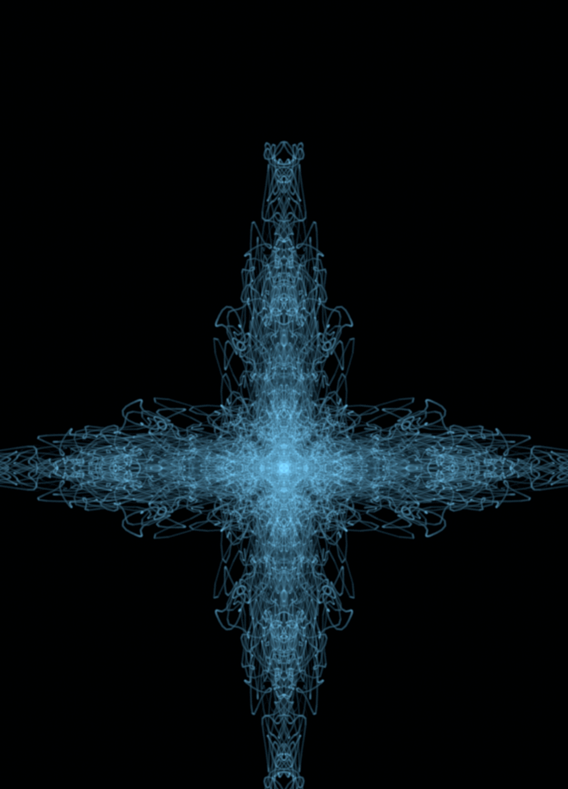
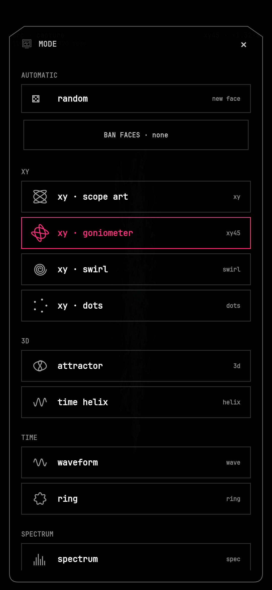
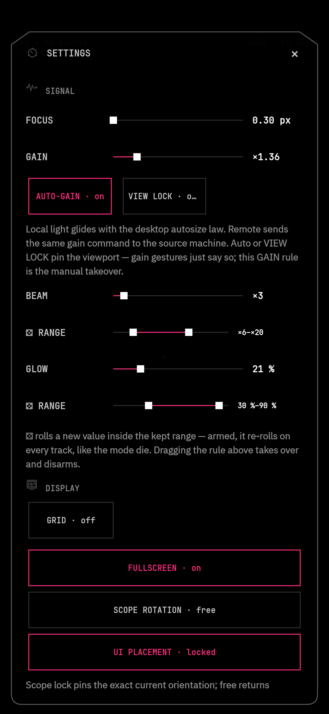

# phosphor-mobil3

Phosphor for Android — a CRT oscilloscope in your pocket. The desktop
[phosphor](https://github.com/RamenFast/phosphor) engine (P7 beam physics, 11 display
modes, real polyphase reconstruction), reimagined as a mobile instrument. Built and
tuned on a Samsung Galaxy S25; runs on arm64 / Android 15+.

<p align="center">
  
  
</p>
<p align="center">
  
  
</p>

## What this is

- **The scope is the app**: full-bleed beam, edge-to-edge, chrome summoned by touch.
  120 Hz panel-locked rendering, one beam deposit per display frame — the same DSP
  crates as desktop phosphor, not an imitation.
- **A real media player** (gapless local playback, lock-screen controls) whose picture
  is sample-locked to what you hear.
- **A visualizer for other apps' audio** via Android playback capture, with track
  metadata and album art mirrored from the source app — honestly labeled: some DRM
  streamers opt out of capture and arrive as silence; games, browsers, and most
  players work.
- **A remote head for desktop phosphor**: stream a PC's audio + scope over your own
  network via the bundled relay (see [docs/REMOTE.md](docs/REMOTE.md)), with adaptive
  latency (tight/balanced/safe) and A/V sync tapped where the ear actually hears.
- **11 scope views** (XY family, 3D attractor/helix, waveform, ring, spectrum family) +
  a **random die ⚄** that re-rolls per track — with a **ban list** so it never lands on
  faces you're tired of.
- **Geometry FX**: kaleido / spin / tunnel / pulse — a 2D transform stage that bends
  the beam after the mode draws it, composing with every view; spin and pulse ride the
  audio envelope.
- **Randomizer dice for BEAM and GLOW**: pick a range, tap the die, and the instrument
  re-rolls itself inside your bounds on every track.
- **13 chrome rooms**, custom beam colors with 1–3 slot cycles, portrait + landscape
  with scope-rotation and UI-placement locks, photosensitivity guards on strobe-capable
  settings.
- Screen stays awake while you watch; picture-in-picture is the floating window.

## Installing

Grab the signed APK from [Releases](../../releases), check it, sideload it:

```
sha256sum -c SHA256SUMS.txt
adb install phosphor-mobil3-<version>.apk
```

No Play Store, no F-Droid — sideloaded releases with checksums, by design.

## Building

Requires a sibling checkout of [phosphor](https://github.com/RamenFast/phosphor) (the
engine crates are path deps — source of truth stays there) and the Android toolchain:

```
git clone https://github.com/RamenFast/phosphor.git
git clone https://github.com/RamenFast/phosphor-mobil3.git
cd phosphor-mobil3
scripts/bootstrap-android.sh     # one-shot, idempotent; installs in-repo to .toolchain/ (no sudo)
source scripts/env.sh
dev/pm3 build                    # → app/build/outputs/apk/debug/app-debug.apk
```

The whole Android toolchain (JDK, SDK, NDK, Gradle) lives under `.toolchain/` in the
repo — gitignored, self-contained, no home-folder clutter. `env.sh` is self-locating.
No Python is authored or invoked anywhere, build tooling included.

Dev loop against a device (wireless adb):

```
dev/pm3 pair <ip:port> <code>    # once — phone: Developer options → Wireless debugging
dev/pm3 connect                  # mdns autodiscovery
dev/pm3 install && dev/pm3 run
dev/pm3 doctor --json            # the whole toolchain, checked live
```

`dev/pm3 schema` describes the full agent contract (JSON envelopes, NDJSON streams,
errors that name their fix).

### Remote hosts

The REMOTE source list is a build-machine fact, never source. Seed yours in
`local.properties`:

```
phosphor.remoteHosts=studio:192.0.2.10:45777,laptop:192.0.2.20:45777
```

Then run the relay on each desktop — full setup in [docs/REMOTE.md](docs/REMOTE.md).

### Release signing

`local.properties` (or env) may carry `RELEASE_STORE_FILE` / `RELEASE_STORE_PASSWORD` /
`RELEASE_KEY_ALIAS` / `RELEASE_KEY_PASSWORD`; without them, release builds fall back to
debug signing.

## Honest ledger

- arm64 / Android 15+, developed and verified on a Galaxy S25 (120 Hz panel). Other
  devices should work; they simply haven't been bench-tested.
- Playback capture requires the system consent dialog per session (Android's rule, not
  ours), and track metadata needs Notification access (a deep-link in SOURCE walks you
  there).
- The engine renders honestly: the panel presents at 120 Hz; "beam rate" reconstructs
  more points inside each contiguous audio window rather than pretending to more frames.

GPL-3.0-or-later. Ferried by Claude.
